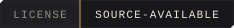

# Reliquary Terminal Theme

[](./LICENSE)
[](#)
[](#)

A jewel-tone Gothic terminal theme for Windows: an [oh-my-posh](https://ohmyposh.dev/) prompt theme and a Windows Terminal colour scheme, sharing one palette so the prompt line and the text it sits above read as the same visual world.

Most terminal themes style one of these and leave the other to a mismatched default. Reliquary covers both halves — the prompt segments (path, git status, exec time, language versions) and the actual ANSI-16 palette regular command output uses — from the same source values.

## Why this exists

Prompt themes and terminal colour schemes are two independent settings surfaces — oh-my-posh doesn't touch your `ls` colours, and your terminal emulator's ANSI palette doesn't touch your prompt segments. Left alone, they drift: a carefully chosen prompt theme sitting on top of whatever ANSI defaults shipped with the terminal. Reliquary ties both to the same jewel-tone palette as its [VS Code](https://github.com/Freehold-Foundry/reliquary-vscode-theme) sibling, so a shell opened inside VS Code's integrated terminal and a native Windows Terminal window look like the same environment.

## What's included

- **`oh-my-posh/reliquary.omp.json`** — the prompt theme. Styles the segments shown in the prompt line itself: OS/username/path/git/exec-time/status on the left, language-version indicators (Python, Go, Node, Ruby, Java) on the right, a time segment below.
- **`windows-terminal/reliquary.json`** — the Windows Terminal colour scheme. The ANSI-16 palette for regular command *output* text (`ls` colours, `git diff` colours, and so on) — independent of the prompt-segment colours above.

## Install

**Prerequisites:** [oh-my-posh](https://ohmyposh.dev/docs/installation/windows) installed, Windows Terminal, and a [Nerd Font](https://www.nerdfonts.com/) set as your terminal's font (the prompt theme uses Nerd Font glyphs for OS/segment icons).

```powershell
git clone https://github.com/Freehold-Foundry/reliquary-terminal-theme.git
```

**Prompt theme:** point oh-my-posh at `oh-my-posh/reliquary.omp.json` from your PowerShell profile (`$PROFILE`):

```powershell
oh-my-posh init pwsh --config 'C:\path\to\reliquary-terminal-theme\oh-my-posh\reliquary.omp.json' | Invoke-Expression
```

**Terminal colour scheme:** open Windows Terminal's settings (`Ctrl+,` → *Open JSON file*), paste the contents of `windows-terminal/reliquary.json` into the top-level `"schemes"` array, then set `"colorScheme": "Reliquary"` on whichever profile you want it applied to.

## Palette

All hex values trace back to the Freehold Foundry's shared Master Palette — the same values used by the [VS Code theme](https://github.com/Freehold-Foundry/reliquary-vscode-theme).

| Role | Dark / muted | Bright | Used for |
|---|---|---|---|
| Ground (background) | `#14141A` | — | Terminal background |
| Text | `#F0E6D6` | `#FFF8EC` | Foreground text |
| **Gold, the UI accent** | `#C9A24B` | `#E8C468` | Cursor, prompt-line accents |
| Amethyst | `#3D1E5C` | `#B27EE8` | Username segment, ANSI purple |
| Sapphire | `#1B3A66` | `#6FB3E0` | Path segment, ANSI blue |
| Emerald | `#164D34` | `#3EE0A0` | Git clean/added state, ANSI green |
| Garnet / Ruby | `#5C1A2E` | `#E45D75` | Errors, exit-code failure state, ANSI red |
| Teal | `#1C5C56` | `#7FE0D6` | ANSI cyan |

The "normal" (non-bright) ANSI tier measures well under 4.5:1 against the near-black background by design — matching most popular terminal schemes (Solarized, Nord, Gruvbox), where these colours mark short glyphs and status letters, not paragraphs of body text.

## Structure

```
reliquary-terminal-theme/
  oh-my-posh/
    reliquary.omp.json      the prompt theme
  windows-terminal/
    reliquary.json           the terminal colour scheme
  .github/badges/            self-hosted README badges
  LICENSE                    Apache 2.0, modified by the Commons Clause
  README.md
```

## Contributing

Issues and pull requests are welcome. Most changes are a matter of editing one of the two JSON files directly — there's no build step for either artefact.

## License

Free and source-available — not OSI-approved open source. Licensed under Apache 2.0, modified by the Commons Clause: you can read, use, and modify this theme freely; the Commons Clause condition restricts reselling the software itself. See [`LICENSE`](./LICENSE) for the full text.

---

[](https://github.com/Freehold-Foundry)

Reliquary Terminal Theme is a **[Freehold Foundry Project](https://github.com/Freehold-Foundry)**, a free and source-available initiative.
